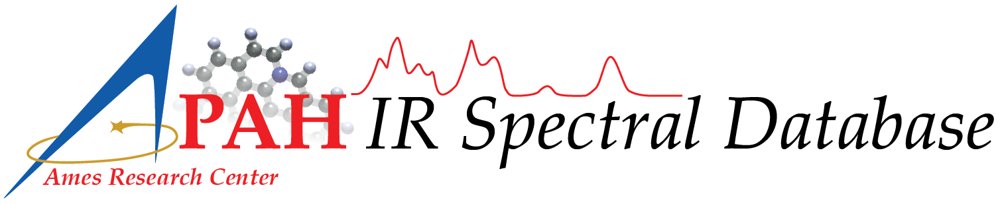

`NASA <https://www.nasa.gov>`_: `Ames Research Center <https://www.nasa.gov/ames>`_: `The Astrophysics & Astrochemistry Laboratory <https://astrochemistry.org/>`_

AmesPAHdbPythonSuite
==================================

NASA Ames PAH IR Spectroscopic Database
---------------------------------------

The NASA Ames PAH IR Spectroscopic Database [#f1]_ [#f2]_ [#f3]_ (PAHdb
hereafter) hosts the world's foremost collection of infrared (IR) PAH spectra.
PAHdb's spectral libraries contain over 4,000 laboratory measured and quantum
chemically computed PAH spectra. Beyond spectroscopic data, PAHdb also provides
software tools to work with the spectral data. The portal to the data and tools
is the PAHdb website, which is located at `https://www.astrochemistry.org/pahdb
<https://www.astrochemistry.org/pahdb>`_. This is the manual for the
AmesPAHdbPythonSuite and describes its features and capabilities.

Please consult the `website <https://www.astrochemistry.org/pahdb>`_
for additional resources and information, and the PAHdb
`cookbook <https://pahdb.github.io/cookbook/>`_ for general usage and examples.

.. toctree::
   :hidden:
   :maxdepth: 1

   installation
   usage
   api
   release-history
   faq
   amespahdbpythonsuite

*Last updated October, 2025*

.. rubric:: Footnotes

.. [#f1] From FY2025 onward the NASA Ames PAH IR Spectroscopic Database is
   being supported through the Laboratory Astrophysics Round 3 directed Work
   Package at NASA Ames.

.. [#f2] From FY2023-2025 the NASA Ames PAH IR Spectroscopic Database was
   supported through the Laboratory Astrophysics Round 2 directed Work Package
   at NASA Ames.

.. [#f3] From FY2019-2022 the NASA Ames PAH IR Spectroscopic Database was
   supported through a directed Work Package at NASA Ames titled: "*Laboratory
   Astrophysics & The NASA Ames PAH IR Spectroscopic Database*".
